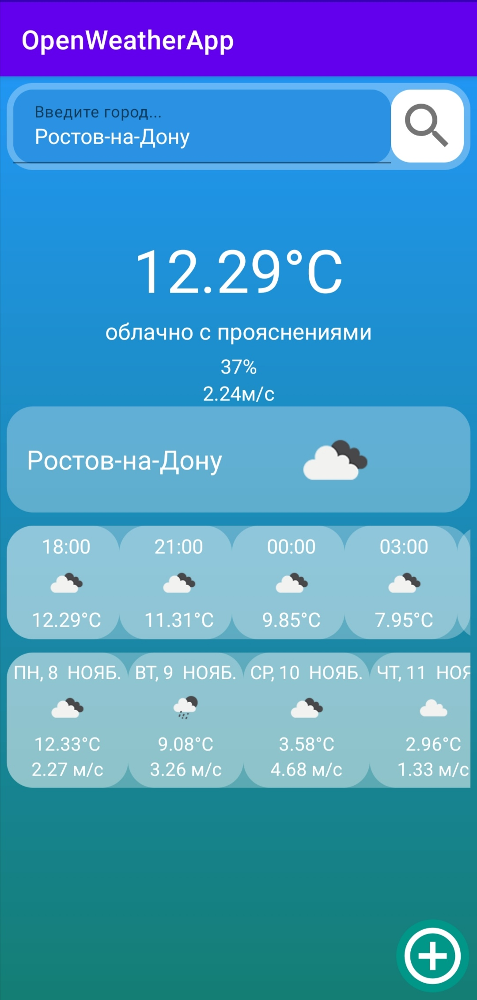
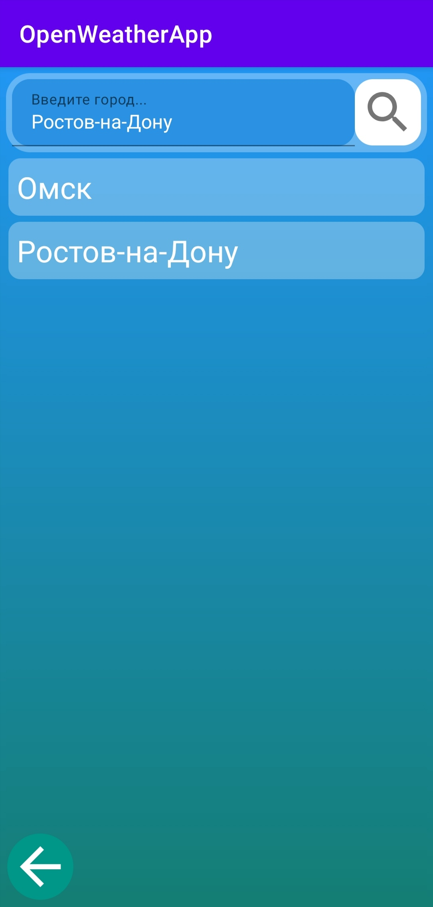
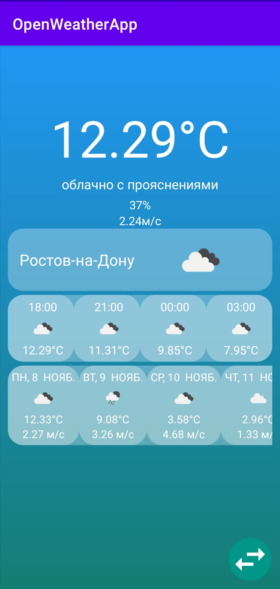

# OpenWeatherApp

ТЗ Mobile
Приложение Погода основаное на API OpenWeatherMap (5 Day Weather Forecast)

Screenshots

  

В приложении можно:
- искать погоду по названию города
- получать текущую погоду, почасовой прогноз на сутки, а так же погоду на ближайшие 4 дня (погода отображается с фото)
- можно сохранять/удалять города (удаляется длинным нажатием по выбраному городу)
- из RecyclerView со списком городов можно перейти к погоде по выбраному городу (кликнув на выбраный город, обычным нажатием)
- из RecyclerView со списком городов так же можно вернуться на главную страницу (нажав кнопку со стрелкой)
- после выбора города - отображается актуальная погода, с этого фрагмента можно перейти на фрагмент со списком городов

В проекте применялись:
- Retrofit2
- RxJava2
- Glide
- SQLite

Подготовительные действия:
- нужно не менять версию gradle (оставить classpath "com.android.tools.build:gradle:4.1.3")

Информация о доступах:
- пароль от OpenWeatherMap API уже есть в проекте

Для запуска проекта нужно скопировать ссылку на репозиторий с проектом (git clone)
